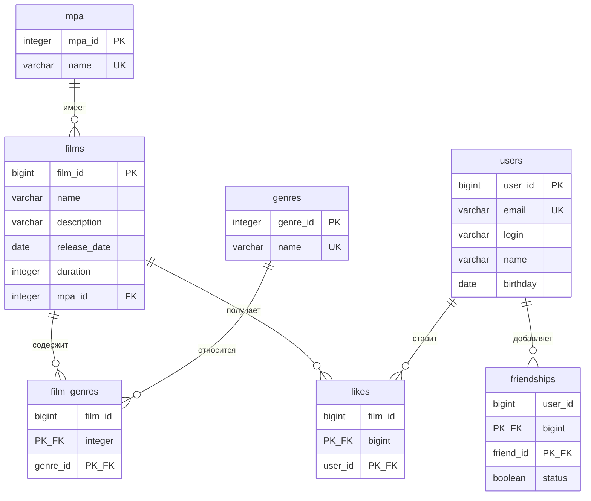

# java-filmorate

Сервис для работы с фильмами и оценками пользователей. Хранит фильмы, пользователей, лайки и дружеские связи в базе данных H2.

## Схема базы данных



Пояснения к схеме:

- `mpa` и `genres` это справочники. Рейтинг у фильма один, жанров может быть несколько.
- `film_genres` и `likes` связывают таблицы многие ко многим. Составной первичный ключ не даёт продублировать жанр у фильма и второй лайк от того же пользователя.
- `friendships` хранит одностороннюю дружбу: строка означает, что `user_id` добавил `friend_id` к себе в друзья. Поле `status` отражает подтверждение заявки.

## Примеры запросов

Получить топ 10 фильмов по количеству лайков:

```sql
SELECT f.film_id, f.name, m.name AS mpa_name
FROM films f
JOIN mpa m ON m.mpa_id = f.mpa_id
LEFT JOIN likes l ON l.film_id = f.film_id
GROUP BY f.film_id, f.name, m.name
ORDER BY COUNT(l.user_id) DESC, f.film_id
LIMIT 10;
```

Найти общих друзей двух пользователей:

```sql
SELECT u.user_id, u.login
FROM friendships f1
JOIN friendships f2 ON f1.friend_id = f2.friend_id
JOIN users u ON u.user_id = f1.friend_id
WHERE f1.user_id = ? AND f2.user_id = ?;
```

Получить жанры конкретного фильма:

```sql
SELECT g.genre_id, g.name
FROM film_genres fg
JOIN genres g ON g.genre_id = fg.genre_id
WHERE fg.film_id = ?
ORDER BY g.genre_id;
```

## Запуск

```
mvn clean package
java -jar target/filmorate-0.0.1-SNAPSHOT.jar
```

Приложение поднимается на порту 8080, файл базы данных создаётся в каталоге `db`.
